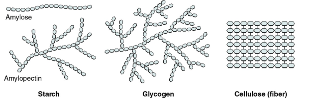

# Notes

## Water
- Small in size
	- Can pass through small circulatory systems
- Very polar, and can hydrogen bond
	- Allows predictable and useful interactions with other molecules
- Density is lower frozen then liquid
	- Causes ice to float
	- Insulates the liquid below the ice, so that living organisms can still survive below the surface in frozen temperatures
- High heat capacity
	- Requires a lot of energy to cause a teeny tiny change in temperature 
	- The high heat capicity maintins the stable enviroment even though tempearutere may change drasitcally 
	- the stable envoriment produced is good for aquauctic and land animals
	- the stable envoriment is also good for the biochemical reactions inisde cells
- High heat of Vapourization 
	- used for cooling down plants, as it allows organimsims to pass off eerngy into water, and have it evoperate away from the body
	- also effective in cooling plants via transpiration on the leaves
- Strong solvent
- High cohesion and surface tesnions
	- allows for transportation down capillary tubes or up xylem

## Carbohydrates
- Most hexose carbohydrates live in the ratio of $(CH_{2}O)_{2}$
- Functions
	- Base form of organic energy
	- Large polysaccerides can be used for long term storage
	- Large polysaccherides can be used for strucutreal compononets (IE: cell wall and chitin)
- Monosaccharides
	- quick energy
	- main 3 are glucose, fructose, galactose
	- all carbons in a normal carbohydrate are bonded to one oxygen in the form of a hydroxide group, but carbon one is bonded to two 
		- deoxyribose does not follow this rule
	- will break apart and enter a linear form when in a dry state, and form back into rings when in a wet state 
	- will bond during a condensation reaction to form "glycosidic bonds"
- Polysaccharides
	- Formed when many monosaccharides link up to form a long chain 
	- ideal for storing energy long term, as theu are easily borken and then built up again
	- common examples include starch, glycogen, amylose, amylopectin and cellulose 
	- 
	- any straight chains made up of $\alpha$-glucose are formed from 1-4glycosidc bonds, and any branches are formed initally by a 1-6 glycosidc bond
	- glycogen
		- insoluble
		- very branched
		- good for storage
		- found in animals and some fungi
		- 
	- Amylose
		- spiral structure
		- unbranched
		- hard to break down
		- 
	- Amylopectin
		- branched strucutre 
		- can be broken down much more rapidly
		- 
	- Cellulose
		- Structural components of plant cell walls
		- made up of $\beta$-glucose
		- 
	- chitin
		- just cellulose but also has nitrogen in the monomer 
## Proteins
- found everywhere in body, but some examples include: nails, hair, muscles, hormones, enzymes, channels, blood, etc...
- Protiens are very large macromolecules and are made of long chains of amino acids
- Amino acids
	- 
	- there are 20 uniuqe amino acids needed to make all the proteins humans need
	- 9 of them are not produced in the body, meaning they are essential and therefore must be eaten
	- will form togeteher via peptide bonds into polypeptides (protiens)
	- two amino acids is a dipeptide, and three + is a polypeptide
	- you can break down polypeptides in hydrolyssis reactions
- almost every protein we deal with will start its chain with methionine
- a polypeptide is not a protien, as there are 4 levels to protien structure
	- 
	- the $\alpha$-helices and the $\beta$-sheets are formed via hydrogen bonds (dont let banit fool you)
- protiens get thier function from thier shape (think enzymes)
- an example of protien shape affecting things is sickle cell anaemia, which causes the hemoglobin in blood cells to cause them to deform
- this loss of shape is called protien denaturation
- the point of a high fever is to attempt to denature the protiens in the bacteria infecting us, but it may also just denature our own enzymes 
## Lipids
- Function
	- Storage of energy
	- insulation (blubber)
	- more energy rich than carbohydrates 
	- in cell membranes 
	- provides strucutre everywhere
- Fats and oils are a group of lipids which are generally triglycerides
- triglycerides are made from one glycerol moleucle and three other things
	- 
- condensation reactions form ester linkages inbetween the glycerol and its fatty acid chains
- phsopholipids are triglyeecireds but they just have a phospahte group as well instead of a third fatty acid
	- this causes the uniuqe proeprty of being both hydrophillic and hydrophobic at the same time
- Saturated fats are solid at room temprature and are mostly present in animal fats 
- unsatuerated fats are liquid at room temperature and are present in plant fats
- steriods are a type of lipd, and are signanlling moleucles 
	- we only care about idenitifying steriods by the fact they have 4 carbon rings
- waxes are a type of lipid which are just very long chains of fatty acids 
	- waxes are often waterproof and act as a barrior
## Nucleic Acids
- DNA & RNA, deoxyriboneculiec acid and ribonucliec acid
- heredity and genes
- DNA and RNA are made up of repeating nucleotides 
- nucleotides are each made up of :
	- Deoxyribose (dna) or ribose (rna)
	- phospahe group
	- nitrogenous base
		- guanine (Purine)
		- cytosine (Pyrimidines)
		- adenine (Purine)
		- thymine (DNA only) (Pyrimidines)
		- uracil (RNA only) (Pyrimidines)
- 1-5 phosphdiester bonds make up the nuclteatide chains
- nitrogonues base and the ribose sugar form glyclsoicd bonds 

## Enzymes 
- biological catyalysts 
	- spered up reactions by lowering activation ererngy 
	- are notused up during reactions
- Anabolic reactions 
	- are when you build new chemcials and add energy to the commpounds
	- synthesis 
	- small to big
- catabolic reactiosn 
	- are when you break substances down and release erngy from breaking bonds
	- digestion
	- big to small
- these two reaction types combindes is what forms our metabolism 
- exergonic (energy released), and endergonic (energy abosrobed)
- enzymes are made of globular protiens 
- terms
	- Substrate: the reactant which binds to the enzyme
	- Product: end result of the reaction
	- active site: the catalytic site in which the subtrate fits
	- enzyme usbtrate complex: the complex formed when the usbtrate and the enzyme interact
	- allosteric stie: the site in wich the non competative inhibor fits
- 

# Lab Summaries

# Review Questions

# Reminders 