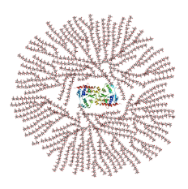
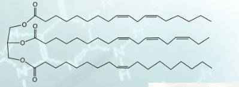
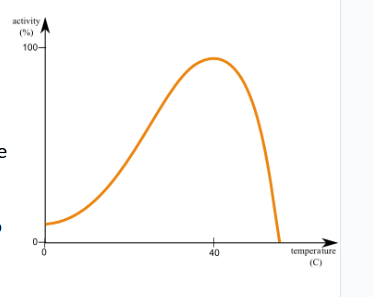
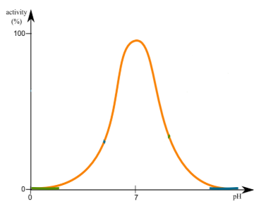
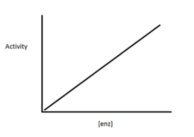
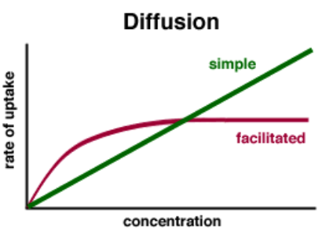

# Notes

## Water
- Small in size
	- Can pass through small circulatory systems
- Very polar, and can hydrogen bond
	- Allows predictable and useful interactions with other molecules
- Density is lower frozen then liquid
	- Causes ice to float
	- Insulates the liquid below the ice, so that living organisms can still survive below the surface in frozen temperatures
- High heat capacity
	- Requires a lot of energy to cause a teeny tiny change in temperature 
	- The high heat capacity maintains the stable environment even though temperature may change drastically 
	- the stable environment produced is good for aquatic and land animals
	- the stable environment is also good for the biochemical reactions inside cells
- High heat of Vaporization 
	- used for cooling down plants, as it allows organisms to pass off energy into water, and have it evaporate away from the body
	- also effective in cooling plants via transpiration on the leaves
- Strong solvent
- High cohesion and surface tensions
	- allows for transportation down capillary tubes or up xylem

## Carbohydrates
- Most hexose carbohydrates live in the ratio of $(CH_{2}O)_{n}$
- Functions
	- Base form of organic energy
	- Large polysaccharides can be used for long term storage
	- Large polysaccharides can be used for structural components (IE: cell wall and chitin)
- Monosaccharides
	- quick energy
	- main 3 are glucose, fructose, galactose
	- all carbons in a normal carbohydrate are bonded to one oxygen in the form of a hydroxide group, but carbon one is bonded to two 
		- deoxyribose does not follow this rule
	- will break apart and enter a linear form when in a dry state, and form back into rings when in a wet state 
	- will bond during a condensation reaction to form "glycosidic bonds"
- Polysaccharides
	- Formed when many monosaccharides link up to form a long chain 
	- ideal for storing energy long term, as they are easily broken and then built up again
	- common examples include starch, glycogen, amylose, amylopectin and cellulose 
	- 
	- any straight chains made up of $\alpha$-glucose are formed from 1-glycosidic bonds, and any branches are formed initially by a 1-6 glycosidic bond
	- glycogen
		- insoluble
		- very branched
		- good for storage
		- found in animals and some fungi
		- 
	- Amylose
		- spiral structure
		- unbranched
		- hard to break down
		- 
	- Amylopectin
		- branched structure 
		- can be broken down much more rapidly
		- 
	- Cellulose
		- Structural components of plant cell walls
		- made up of $\beta$-glucose
		- 
	- chitin
		- just cellulose but also has nitrogen in the monomer 
## Proteins
- found everywhere in the body, but some examples include: nails, hair, muscles, hormones, enzymes, channels, blood, etc...
- Proteins are very large macromolecules and are made of long chains of amino acids
- Amino acids
	- 
	- there are 20 unique amino acids needed to make all the proteins humans need
	- 9 of them are not produced in the body, meaning they are essential and therefore must be eaten
	- will form together by peptide bonds into polypeptides (proteins)
	- two amino acids is a dipeptide, and three + is a polypeptide
	- you can break down polypeptides in hydrolysis reactions
- almost every protein we deal with will start its chain with methionine
- a polypeptide is not a protein, as there are 4 levels to protein structure
	- 
	- the $\alpha$-helices and the $\beta$-sheets are formed via hydrogen bonds (don't let banit fool you)
- proteins get their function from their shape (think enzymes)
- an example of protein shape affecting things is sickle cell anaemia, which causes the hemoglobin in blood cells to cause them to deform
- this loss of shape is called protein denaturation
- the point of a high fever is to attempt to denature the proteins in the bacteria infecting us, but it may also just denature our own enzymes 
## Lipids
- Function
	- Storage of energy
	- insulation (blubber)
	- more energy rich than carbohydrates 
	- in cell membranes 
	- provides structure everywhere
- Fats and oils are a group of lipids which are generally triglycerides
- triglycerides are made from one glycerol molecule and three other things
	- 
- condensation reactions form ester linkages in between the glycerol and its fatty acid chains
- phospholipids are triglycerides but they just have a phosphate group as well instead of a third fatty acid
	- this causes the unique property of being both hydrophilic and hydrophobic at the same time
- Saturated fats are solid at room temperature and are mostly present in animal fats 
- unsaturated fats are liquid at room temperature and are present in plant fats
- steroids are a type of lipid, and are signaling molecules 
	- we only care about identifying steroids by the fact they have 4 carbon rings
- waxes are a type of lipid which are just very long chains of fatty acids 
	- waxes are often waterproof and act as a barrier
## Nucleic Acids
- DNA & RNA, deoxyribonucleic acid and ribonucleic acid
- heredity and genes
- DNA and RNA are made up of repeating nucleotides 
- nucleotides are each made up of :
	- Deoxyribose (dna) or ribose (rna)
	- phosphate group
	- nitrogenous base
		- guanine (Purine)
		- cytosine (Pyrimidines)
		- adenine (Purine)
		- thymine (DNA only) (Pyrimidines)
		- uracil (RNA only) (Pyrimidines)
- 1-5 phosphodiester bonds make up the nucleotide chains
- nitrogenous base and the ribose sugar form glycosidic bonds 

## Enzymes 
- biological catalysts 
	- speed up reactions by lowering activation energy 
	- are not used up during reactions
- Anabolic reactions 
	- are when you build new chemicals and add energy to the compounds
	- synthesis 
	- small to big
- catabolic reaction 
	- are when you break substances down and release energy from breaking bonds
	- digestion
	- big to small
- these two reaction types combined is what forms our metabolism 
- exergonic (energy released), and endergonic (energy absorbed)
- enzymes are made of globular proteins 
- terms
	- Substrate: the reactant which binds to the enzyme
	- Product: end result of the reaction
	- active site: the catalytic site in which the substrate fits
	- enzyme substrate complex: the complex formed when the substrate and the enzyme interact
	- allosteric site: the site in which the non competitive inhibitor fits
-  each enzyme is reaction specific and works with a particular substrate
- enzymes are not consumed by the reaction and are generally unaffected
- factors that may affect enzyme activity include
	- Temperature
		- increased temp = increased rate until the optimum temperature is reached 
		- more kinetic energy = more collision = more ROR
		- increasing the temperature past the optimum point induces a loss of the enzyme's shape causing protein denaturation 
		- 
	- PH
		- enzymes function over a narrow pH range 
		- when ph is altered, ionic bonding is disrupted, causes change in 3D shape, denaturation 
		- 
	- Substrate concentration
		- as the substrate concentration, the initial rate increases linearly
		- eventually the enzymes active sites are all occupied, and the max throughput is reached, thus the rate can only be increased by adding more enzymes
		- 
	- enzyme concentration
		- if the substrate concentration is maintained, the rate of reaction will increase linearly in relation to the concentration of enzymes
		- 
- Enzymes have two models,
	- the lock and key model which is not widely accepted
		- each enzyme has a complementary shape of the substrate and both dont change
	- the induced fit which is widely accepted
		- enzymes will mould to fit  itself around the substrate upon binding
- molecules will bind to an enzyme to prevent the reaction from taking place, they may also bind to the active site or somewhere else in the enzyme structure
	- these fall into 2 categories 
		- competitive inhibitors
			- resembles the substrate and competes for the active site, will slow or stop the reaction
		- non competitive inhibitors
			- will bind to a site other then the active site and will block enzyme function physically or 
			- allosteric inhibitors will block enzyme function by altering the shape
- often, the last step of a reaction will act as inhibitors for the earlier steps to avoid over saturating the cell with unnecessary products
	- 

## Cell membrane 
- cell membranes control what goes in and out of the cell 
- it is made up of a phospholipid bilayer, and the "Fluid mosaic model" is often used to describe it
- the "Fluid mosaic model" comes from the fact that it's constantly in motion, fluid, and is made up of a lot of small parts, mosaic
	- more specifically the cholesterol in the cell wall will keep the phospholipids liquid at different temperatures to ensure fluidity of the cell membrane
- Phospholipids
	- hydrophobic heads and hydrophilic tails cause them to form a bilayer surrounding the cell
	- this blocks most unwanted substances from passing through (especially polar and large substances)
- cholesterol 
	- is found along side the phospholipids in the membrane
	- stabilizes the membrane and ensures it stays liquid 
	- at low temperatures it keeps philips from freezing and packing together 
	- at high temperatures it holds them from separating apart and dissociating
- proteins
	- active and passive transport across the cell membrane 
	- signaling 
	- enzymes in the cell and on the cell
	- attachment points for the cytoskeleton
	- three types:
		- integral
			- in the membrane but not all the way through
		- transmembrane integral 
			- proteins go all the way through
		- peripheral proteins
			- on the surface of the membrane
	- mostly on the inside of the cell
- carbohydrates
	- on the outer surface, and are predominantly signaling molecules
	- two types
		- glycoproteins, a carbohydrate attached to a protein
		- glycolipids, a carbohydrate attached to a lipid
	- they are cellular markers for the immune system to recognize the cell as part of the human body and good

## Transportation across the membrane

- oxygen and carbon dioxide can move through the cell membrane via passive diffusion
- water enters via aquaporins and travels through the cell via Facilitated diffusion
- glucose travels through the cell via GLUT transporters, which is just protein facilitated diffusion
- sodium and potassium travel through the cell membrane via active transport and protein pumps. this requires atp 
	- the sodium and potassium pumps use the energy from the high concentration sodium moving to the low concentration sodium to move the potassium, but it's still not sufficient so it still requires atp
- enzymes move through exocytosis 
- summery
	- 
- simple diffusion will linearly increase as concentration increases, but facilitated diffusion will follow a root x curve, due to the throughput of the pumping proteins being reached 
	- 
- hypotonic
	- cell expands due to high concentration of solute inside the cell causing water to move in
- isotonic
	- equilibrium is reached and water flows in and out
- hypertonic
	- high concentration outside of the cell causing water to move outside, shrinking the cell
- 3 types of endocytosis
	- phagocytosis
		- fusing with the lysosome for the digestion of solid goods
	- pinocytosis
		- drinking the interstitial fluid to gain the electrolytes
	- receptor mediated endocytosis
		- will only eat stuff after certain receptor molecules (carbohydrates) have bonded with certain molecules
- exocytosis is always done via vesicles 
- most enzymes must be activated before they can function
- two main types of activators for enzymes
	- cofactors
		- small not organic compounds 
		- attach to sections of the protein to activate it
	- coenzymes
		- small organic compounds
		- attach to sections of the protein to activate 
- fluid outside of cell is called interstitial fluid
- facilitated diffusion 
	- small and charged/polar molecucles cannot pass through the mebrane on thier own
	- instead they must pass through a channel protein or aquaporine or equivlulent 
	- two types of facilliated diffusion
		- carrier mediated 
			- carrier protien carries it through the cell membrane by changing shape (think automatic pump situation)
		- channel mediated 
			- a channel lets things through the cell membrane
			- two main types
				- leak channels are always open
				- gated channels are only opened via stimulus 

# Lab Summaries

# Review Questions

- 
# Reminders 
- Fluid mosiac, fluid because of cholestral and the kinks in the fatty acids 
- two main types of activators for enzymes
	- cofactors
		- small not organic compounds 
		- attach to sections of the protein to activate it
	- coenzymes
		- small organic compounds
		- attach to sections of the protein to activate 