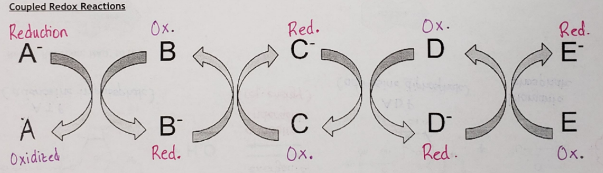
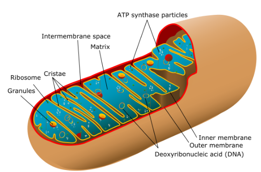

# ATP & Energy
---
- Metabolism is the process the body undergoes to convert food into energy to do work
- recall:
	- First law of thermodynamics, conservation of energy
	- Second law of thermodynamics, systems tend towards a state of disorder
	- Entropy
	- Exergonic/endergonic
- organelles may start to get old and not function well 
	- thus creating disorder in the cell
- the cell needs to "clean up" waste inside the cell, using lysosomes
	- thus creating order in the cell
- in biological systems it is difficult to measure the entropy, because the bond breaking/forming is not as clear-cut as most reactions are very complicated mechanisms
- when there is bond breaking, there is always bond forming, and vice versa
- metabolism reactions often have very high heat release, which needs to be accounted for in some manner
	- manners include:
		- using energy as waste and staving it off via sweating
		- using energy as a product for another reaction 
		- breaks down mechanism to a lot of little steps to make the releases in energy 
- organisms are endergonic systems, we need a lot of energy
- exergonic reactions fuel all the endergonic reactions in the body
	- IE: eating to build muscles
	- this is called energy coupling
- the energy 'currency' of our cells is called ATP
	- Adenosine Triphosphate
	- similar to nucleotides and is a nucliec acid
	- good for short term energy usage (not for storage)
	- 
- ATP can be "hydrolyzed" and lose one of its phosphate and forms ADP and releases energy. the phosphate then bonds to another molecule to give it energy
- then you can add another phosphate to ADP to form another ATP
- when a phosphate is transferred to another molecule the other molecule is called phosphorylated 
# Cellular Respiration Overview
---
- purpose of celular respiration is to convert energy trapped within glucose to energy trapped within ATP, which can do work in the cell much more easy
- see above for ATP and ADP info
- recall REDOX
	- oxidation releases electron, reduction gains electron
	- if something lost an electron, something must gain an electron
	- electrons will be passed along with the following loops like so:
		- 
- Hydrogen Acceptors
	- Coenzymes, they help reactions involving enzymes
	- $NAD^+$ or $FAD^+$ are coenzymes in an oxidized form
	- $NADH$ or $FADH$ are coenzymes in a reduced form
	- energy carriers 
- one cycle of cellular resperation will produce 38 mols of ATP, with a majority being from the electron transport system 
- in eukaryotic cells, stage 1 occurs in the cytosol. the rest of the stages occur in the mitochondrion 
- structure of the mitochondrion:
	- 
	- Matrix, tons of enzymes molecules nuetrins etc are floating in there, this is where electron transport happens. the folds in the matrix (cristae) increase the surface area
	- inner membrane, tons of enzyme complexes which produce atp (called stalked particles)

- ## Cellular respiration Pogil
	- Model 1:
		- 
	- According to Model 1, what are the reactants of cellular respiration?
		- $C_{6}H_{12}O_{6}$ and $O_2$
	- According to Model 1, what are the products of cellular respiration?
		-  $ATP$, $H_2O$ and $CO_2$
	- Cellular Respiration occurs in four phases: glycolysis, the link reaction, Krebs cycle and oxidative phosphorylation.
		- Which phase of cellular respiration occurs in the cytoplasm of the cell?
			- Glycolysis
		- Which phase(s) of cellular respiration occur in the mitochondria?
			- Krebs Cycle, Oxidative phosphorylation, and the link reaction
		- Which of the four phases produce carbon dioxide?
			- The link reaction
		- Which of the four phases produce water?
			- Oxidative phsophorylation
	- The goal of C.R. is to produce the cell with energy in the form of ATP. 
		- Which of the four phases result in the production of ATP?
			- Glycolysis, krebs Cycle, and Oxidative phosphorylation
		- How many ATPs (net total) are produced for every ONE glucose molecule that undergoes C.R.?
			- 38
		- What reactants of ATP must be available in the cell in order to produce ATP?
			- ADP and phosphate
		- Brainstorm several processes for which energy or ATP is necessary
			- active transport 
			- cell signlaing 
			- rna synthesis 
			- muscle contraction
	- Besides ATP, what other molecules appear to be high potential energy molecules (free energy carriers) during cellular respiration?
		- $NADH$ and $FADH$
	- Model 2:
		- 
	- Are the reactions (to create $NADH$, $FADH_2$, $H_2O$)  in model 2 oxidation or reduction reactions?
		- Reduction 
		- Reduction 
		- Reduction
	- Which form of nicotinamide adenine dinucleotide is the reduced form, NAD+ or NADH? Explain.
		- NADH
	- The hydrogen ions and electrons that were carried by $NADH$ and $FADH_2$ are used in oxidative phosphorylation.
		- What molecules are produced as the hydrogen ions and electrons are removed from $NADH$ and $FADH_2$?
			- $NAD^+$ and $FAD^{2+}$
		- Is the removal of hydrogen ions and electrons from NADH and FADH2 oxidation or reduction? Explain.
			- Oxidation 
	- Cells can survive for short periods without oxygen. Only the glycolysis phase of cellular respiration occurs in these circumstances.
		- Predict the number of ATP molecules that could be produced from one glucose molecule if oxygen were not available .
			- 4
		- Oxidative phosphorylation no longer occurs when oxygen is not available, predict what would eventually happen to the supply of NAD+ in the cell if only glycolysis were occurring?
			- It would oversaturate, causing problems

# Glycolysis
---
- the goal of cellular respiration is to capture free energy in glucose to form ATP
- in order to achieve this tow methods are used:
	- substrate level phosphorylation
	- oxidative phosphorylation
- Substrate level phosphorylation
	- ATP is formed directly from the enzyme controlled reactions (in glycolysis and krebs cycle)
	- occurs when a phosphate group is transfeered from one moleucle to an ADP molecule
-  oxidative phosphorylation
	- ATP is formed indrecitly via multiple different steps in the electron transport chain 
	- formed via a sereies of redox reactions
- pyruvate will undergo krebs cycle and ETC only if $O_2$ is present 
- Glycolysis occurs in the cytosol/cytoplasm
- glycolysis convertss glucose into 2 pyruvate ($C_{3}H_3O_3^-$)
- glycolysis is an anarobic process
- glycolysis requires ATP to start, is refered to the enrgy input stage to get the rest of the cycle going 
- 
