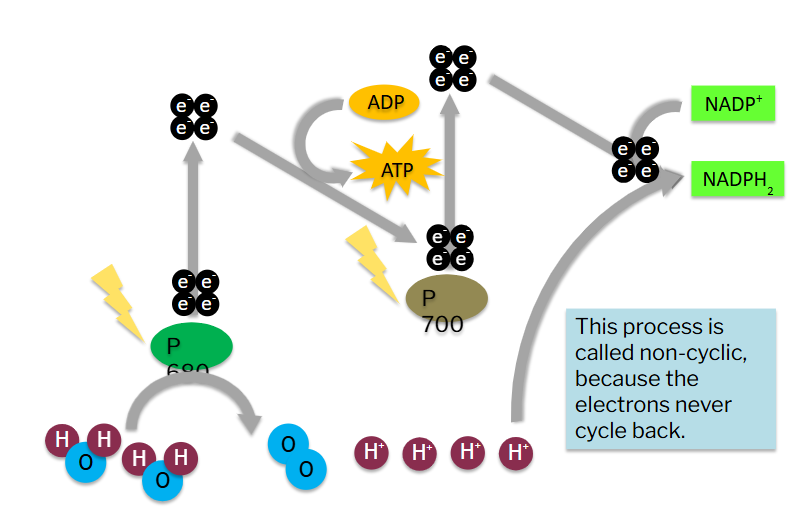
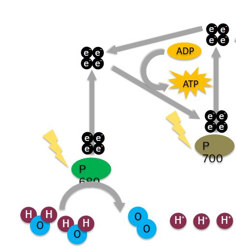

# Chloroplasts & Pigments
1. What are 3 things that will enter a leaf?
	- Light, $CO_2$ and $H_2O_{(Liquid)}$
2. What are things that leave a leaf?
    - $O_2$, $H_2O_{(gas)}$, Sugars
3. Which compound both enters and leaves? Are there any changes made to it?
    - $H_2O$, goes from $_{(liquid)}$ to $_{(gas)}$ 
4. Labeled Diagram for a plant leaf
	- 
5. What type of cells have chloroplasts?
	- Palisade mesophyll, some in the spongy, but not as much
6. Through which layers does light travel to reach the palisade mesophyll? What does that mean about those layers?
	- 2, means that they are transparent
7. During the times when the stomata is closed, how would this affect photosynthesis?
    - no carbon dioxide can enter the leaf, and therefore the rate of photosynthesis will significantly decrease and eventually stop  
8. Plants that live on the floor of forests tend to have much larger leaves than plants that live in hot, sunny conditions. Offer an explanation for this
    - the sun causes a lot of water loss, and if you have large broad leaves in a sunny environment, you will expending a lot of water to maintain homeostasis
    - Additionally, on the forest floor you have less of an opportunity to catch sunlight, so a bigger surface area would be more optimal to catch more sunlight. 
- Photosynthesis
	- occurs in the chloroplasts 
	- uses energy from sunlight
	- $6CO_2 + 6H_2O\to C_{6}H_{12}O_{6} +6O_{2}$
- Chloroplasts contain a green pigment made of protein
	- there are other pigments present
- chlorophyll is the main pigment, and it will absorb the energy from the light to split water 
- labeled diagram of a chloroplasts
	- 
- a photosynthetic pigment is a colored biological compound that is present in chloroplasts and photosynthetic bacteria
- the 2 types of photosynthetic pigments plants are chlorophylls (green) and carotenoids (yellow/orange)
- and there is one type of protective pigments, called anthocyanins (red/purple/blue)
- Structural diagram of a chlorophyll
	- Note the magnesium core 
	- note the ester/phytol tail
	- note that it is made up of various ring structures that contain nitrogen
	- 
- plants use energy from the visible region, 400-710 nm 
- pigment molecules occur in clusters called photosystems (see tomorrow's note)
	- photosystem is a large clump of pigments, and then the light can hit only one pigment of the system, and then the charged electrons can move around across the system to the end goal
- Engelmann's experiment
	- do plants absorb certain colours ?
	- testing out using algae, different colors of light, and aerobic bacteria
	- he then split the light into colors using a prism 
	- and then shone it onto the spirogyra with some aerobic bacteria around it, to see where the bacteria move to (they will try to find the highest concentration of $O_2$)
	- he then got results like this, where the black dots are bacteria:
	- 
	- where the bacteria survive, is where oxygen is most produced, meaning that really short and really long wavelengths are absorbed, and greens is basically unused and therefore reflected back
- Plant pigments absorb red and blue light, every other color is reflected (which is mainly green) 
	- absorption spectra:
	  
- in color temperatures chlorophyll is destroyed, and so the more different light is reflected and the absorption spectra changes, and therefore the color changes
- 

# Light dependent reactions
- Model 1
	- 
1. Consider the organelle illustrated in Model 1.
	-  What is the name of this organelle? Is this organelle more likely to be found in animal cells or plant cells?
		- Chloroplast, will only be found in plant cells

2. The structures inside the organelle in Model 1 are called thylakoids. What compound necessary for photosynthesis is contained in the thylakoids?
	- chlorophyll, which contain the light energy required for the reaction

3. Consider the chemical reaction in Model 1. This represents photosynthesis.
	1. Where in the organelle are these molecules stored before they are used in photosynthesis?
		- the stroma
		
	2. What is the energy source for photosynthesis?
		- Light energy

4. Photosynthesis occurs in two parts—the light-dependent reactions and the light-independent reactions.
	1. What is another name for the light-independent reactions?
		- Calvin cycle, dark reactions 
    
	2. In what part of the chloroplast do each of the reactions occur?
	    - light depended reactions occur in the thylakoid membranes 
	    - dark reactions occur in the stroma

5. Considering your answers to Question 4, what compound is best able to absorb the light energy from the Sun and convert it into chemical energy?
    - the thylakoids
6. Why is it necessary to have six CO2 entering the chloroplast?
	- to provide the 6 carbons for the glucose

- Model 2
	- 

1. In Model 2, what shape or symbol represents a single electron?
    - black dots
2. In the light-dependent reactions electrons are released from molecules in two ways.
    
	1. Find two places in Model 2 where electrons are excited by a photon of light coming from the Sun.
		- Photosystem 1 and 2
	2. Find one place in Model 2 where electrons are released from water molecules. When the electrons are released from water molecules, what other products are formed?
		1. Photosystem 2, hydrogen ions
3. The light-dependent reactions include an electron transport chain system that works in a very similar fashion to the electron transport chain in respiration. 
	1. Which way are the H+ ions moving (location)
	    - from the lumen to the stroma
	2. What structure are they moving through passively?
	    - Atp synthase

  

4. Refer to Model 2
	1. Name the embedded protein complex found in the thylakoid membrane that uses excited electrons to reduce NADP+ into NADPH?
		- Photosystem 1
	2. Name the embedded protein complex found in the thylakoid membrane that provides excited electrons to the electron transport chain?
	    - photosystem2
	3. Name the embedded protein complex found in the thylakoid membrane that converts ADP to ATP using free energy from a flow of hydrogen ions.
	    - atp synthase
5. Calculate the total number of oxygen, NADPH, and ATP molecules that are produced when twelve water molecules complete the light-dependent reactions.
    - 3 atp and 1 $NADPH$ per 2 $H_2O$ molecules
6. Where do the ATP and NADPH produced during the light-dependent reactions go when the process is complete?
    - to the stroma
# Photosynthesis
- transpiration, water is pulled up out of plants 
- stomata are responsible for the regulation of transpiration
- palisade mesophylls will contain most of the chloroplasts, spongy has some too 
- thylakoid disks are hollow on the inside, and are filled with lumen 
- autotrophs are organisms that make their own food, heterotrophs eat food produced by autotrophs
- situated in the membranes of a thylakoid there are two photosystems, both contain chlorophyll in their centre 
- thylakoids only absorb sunlight from specific wavelengths (green and yellow are reflected)
- splitting of water molecule using light is called photolysis
- Non - cyclic photophosphorylation (z-scheme photophosphorylation)

	- a type of light dependent reaction 
	- Producing ATP, reducing $NADP$ to $NADPH$
	- light energy is gonna hit the chlorophyll molecules, then the electrons of chlorophyll will enter a higher energy state, this allows the electron to move down the ETC's
	- electrons are sourced from the water molecules
	- P680 = photosystem 2, and P700 = photosystem 1
	- lightning bolt = sunlight energy
	- the ADP $\to$ ATP is actually an ETC
	- Diagram of the ETC, notice how its the reverse of a animals ETC
	- $NADP^+$ is the final electron acceptor, this is also still a ETC 
	- 

- Cyclic photophosphorylation
	- only ATP is produced
	- if the plant needs more ATP, or $NADP^+$ is in short supply, it will enter cyclic photophosphorylation (think lactic acid in animal cells)
	- the plant doesn't stay here for long, because it needs the products from z-scheme to make glucose in Calvin's cycle
	- 
- 