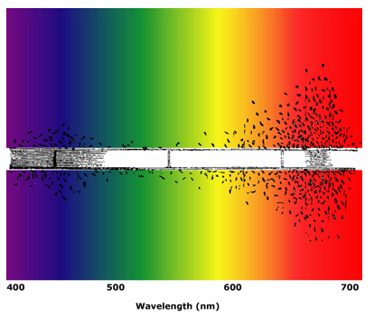
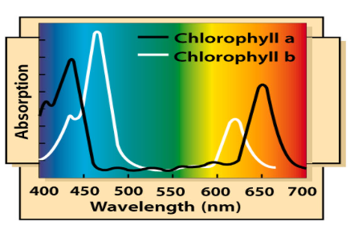

# Chloroplasts & Pigments
1. What are 3 things that will enter a leaf?
	- Light, $CO_2$ and $H_2O_{(Liquid)}$
2. What are things that leave a leaf?
    - $O_2$, $H_2O_{(gas)}$, Sugars
3. Which compound both enters and leaves? Are there any changes made to it?
    - $H_2O$, goes from $_{(liquid)}$ to $_{(gas)}$ 
4. Labeled Diagram for a plant leaf
	- 
5. What type of cells have chloroplasts?
	- Palisade mesophyll, some in the spongy, but not as much
6. Through which layers does light travel to reach the palisade mesophyll? What does that mean about those layers?
	- 2, means that they are transparent
7. During the times when the stomata is closed, how would this affect photosynthesis?
    - no carbon dioxide can enter the leaf, and therefore the rate of photosynthesis will significantly decrease and eventually stop  
8. Plants that live on the floor of forests tend to have much larger leaves than plants that live in hot, sunny conditions. Offer an explanation for this
    - the sun causes a lot of water loss, and if you have large broad leaves in a sunny environment, you will expending a lot of water to maintain homeostasis
    - Additionally, on the forest floor you have less of an opportunity to catch sunlight, so a bigger surface area would be more optimal to catch more sunlight. 
- Photosynthesis
	- occurs in the chloroplasts 
	- uses energy from sunlight
	- $6CO_2 + 6H_2O\to C_{6}H_{12}O_{6} +6O_{2}$
- Chloroplasts contain a green pigment made of protein
	- there are other pigments present
- chlorophyll is the main pigment, and it will absorb the energy from the light to split water 
- labeled diagram of a chloroplasts
	- 
- a photosynthetic pigment is a colored biological compound that is present in chloroplasts and photosynthetic bacteria
- the 2 types of photosynthetic pigments plants are chlorophylls (green) and carotenoids (yellow/orange)
- and there is one type of protective pigments, called anthocyanins (red/purple/blue)
- Structural diagram of a chlorophyll
	- Note the magnesium core 
	- note the ester/phytol tail
	- note that it is made up of various ring structures that contain nitrogen
	- 
- plants use energy from the visible region, 400-710 nm 
- pigment molecules occur in clusters called photosystems (see tomorrow's note)
	- photosystem is a large clump of pigments, and then the light can hit only one pigment of the system, and then the charged electrons can move around across the system to the end goal
- Engelmann's experiment
	- do plants absorb certain colours ?
	- testing out using algae, different colors of light, and aerobic bacteria
	- he then split the light into colors using a prism 
	- and then shone it onto the spirogyra with some aerobic bacteria around it, to see where the bacteria move to (they will try to find the highest concentration of $O_2$)
	- he then got results like this, where the black dots are bacteria:
	- 
	- where the bacteria survive, is where oxygen is most produced, meaning that really short and really long wavelengths are absorbed, and greens is basically unused and therefore reflected back
- Plant pigments absorb red and blue light, every other color is reflected (which is mainly green) 
	- absorption spectra:
	  
- in color temperatures chlorophyll is destroyed, and so the more different light is reflected and the absorption spectra changes, and therefore the color changes
- 

