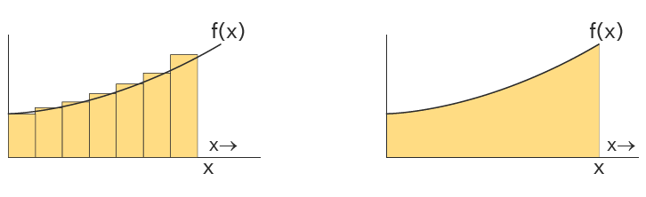
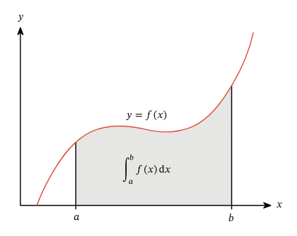

# Intro
today in class, teacher jesse was like "yo $U = \frac{kQq}{r}$" and then was like "dont flipping worry about why thats too complicated"

if you are like me and thats stupid and dumb, here is every single concept you need to know to understand the proof for $U = \frac{kQq}{r}$ explained by me :)
# Integrals

lets start with the intuitive definition

an integral essentially represents the area under a graph

a little bit more specifically, it can be thought of as an approximation of the sum of the area small rectangles under a graph, where our approximation gets more and more accurate as the rectangles get smaller and smaller

basic geometry level, the area of one individual rectangle can be represented as $Area \ = \ Height \cdot Length$ 

note: $dx$ means a small change in $x$ 
Due to our approximations, were assuming $f(x)$ remains constant over $dx$, to form a nice even rectangle, therefore the area in terms of our function is:
$Area = F(x) \cdot x$

 in more formal terms, $dx$ causes a change in $Area$, represented as $dArea$
$$\begin{gather}
\therefore dArea = f(x) \cdot dx \\
\text{Rearranging we can find:}  \\

\frac{dArea}{dx} = f(x)  \\
 \\
\text{this means that the DERIVATIVE of the function that represents  area is actually } f(x)!
\end{gather}
$$

Finding the integral, in practice, is just finding the opposite of the derivative, or the antiderivative
Finding the antiderivative is just finding $g(x)$ where $g\prime (x) = f(x)$, and is mostly done by inspection (like factoring)

Example: $x^2$ is the integral or antiderivative of $2x$

additionally, if we want the area over just a small segment of the graph, we can do something called a definite integral as shown below:

lets define $q(x)$ as the antiderivative or integral of the above function $f(x)$
remember $q(x)$ = a running total of the area from $0 \to x$

therefore to get the area contained in $a \to b$ you need to do $q(b) - q(a)$, which means:
$$
\int^b_{a}f(x) dx = q(b) - q(a) 
$$
# Why do we care + Work

As we learned last year in physics, work is the force $\vec F$ done over distance $x$, which is all well and good for graphs like the one below, where calculating the work done is a simple area calculation. 

But... what happens when you need to calculate  the work done for the following Force over distance graph:

we need definite Integrals!!!!!

So, we can represent work as such: 

$$\begin{gather}
distance = x
\\
x_{2} = \text{ final distance}
\\
x_{1} = \text{intial distance}
\\
W = \int^{x_{2}}_{x_{1}} \vec{ F_{E}} \cdot dx
\end{gather}  $$
recall (i forgot this while writing this, and thought it might be helpful for yall):

In physics, energy is conserved unless external forces do work.

$$\text{Total Energy} = \text{Kinetic Energy} + \text{Potential Energy} $$

Since work is energy transferred, when the field does work, energy must go somewhere. That "somewhere" is either:

1. Increasing kinetic energy
2. Changing potential energy 

# Finally back to Electric Potential Energy 
now we know everything to prove that $U_{E} =\frac{kQq}{r}$ 
lets say we have charge $Q$ which is **Positive** and charge $q$ which is **Negative**

$q$ will be attracted to $Q$, and therefore the Electric Field of $Q$ is doing **Positive** work on $q$

Assuming this is an isolated system, the kinetic energy gained $q$'s must be from $q$'s potential energy

this means that $q$'s potential energy $U_E$, decreases by the work done by the Field $W_E$
$$ 
\therefore \Delta U_{E} = -W_{E}
$$

$$
\begin{gather}
\Delta U_{E} = -W_{E}  \\
\text{From above we know that: } W = \int_{x_{1}}^{x_{2}} F \cdot dx\\
\text{ but since we are working in terms of r and electric feilds:} \\
W_{E} = \int_{r_{1}}^{r_{2}} F \cdot dr\\
\Delta U_{E} = -\int_{r_{1}}^{r_{2}} F_{E} \cdot dr  \\
\Delta U_{E} = -\int_{r_{1}}^{r_{2}}\frac{kQq}{r^2} \cdot dr  \\
\Delta U_{E} = -\int_ {r_{1}}^{r_{2}}kQqr^{-2} \cdot dr  \\
\text{ since kQq is constant, sub it in as Z}  \\
\Delta U_{E} = -\int_{r_{1}}^{r_{2}} Zr^{-2} \cdot dr  \\
\text{ what is the anti derivative of } Zr^{-2} \text{ ?}  \\
\text{well the derivative of } -Zr^{-1} = Zr^{-2} \text{ so the anti derivative of } Zr^{-2} = -Zr^{-1}  \\
\Delta U_{E} = - \int_{r_{{1}}}^{r_{2}} Zr^{-2} \cdot dr  \\
\Delta U_{E} = - (Zr_{2}^{-1} - Zr_{1}^{-1}) \\
\Delta U_{E} = - \left( \frac{Z}{r_{2}} - \frac{Z}{r_{1}} \right)  \\
\text{ sub in Z = kQq}  \\
\Delta U_{E} = - \left(  -\frac{kQq}{r_{2}} - -\frac{kQq}{r_{1}} \right)  \\ \\
\Delta U_{E} = U_{2} - U_{1} = - \left(  -\frac{kQq}{r_{2}} + \frac{kQq}{r_{1}} \right)  \\ 
\text{By definition, } U_{2} = 0 \text{ and } r_{2} = \infty
 \\
  \\
\therefore
0 - U_{1} =   \left(  -\frac{kQq}{\infty} + \frac{kQq}{r_{1}} \right)  \\ 
\frac{\text{anything} }{\infty} = 0 \\
-U_{1} = -(\frac{kQq}{r_{1}}) \\
U_{1} = \frac{qQq}{r_{1}}
\end{gather}
$$
this took me ~3 hours to make/learn, hope this helped!
-A

$$
\frac{\lambda 12}{3 } = a_{2} 
$$