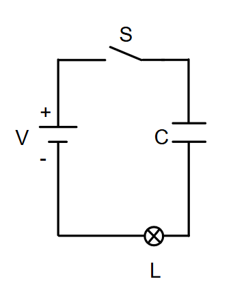
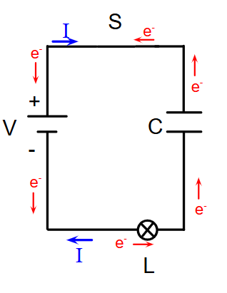
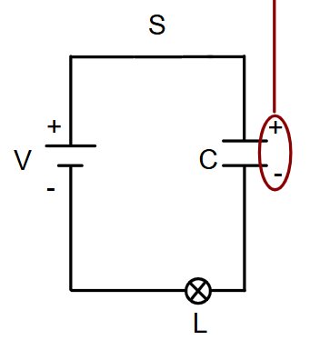
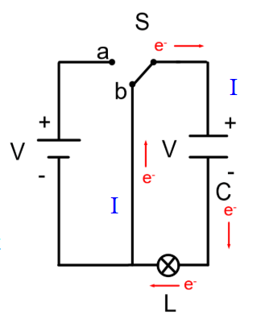

## V = RI
---
- this is the foundation of the circuit analysis
- we can use it for the total circuit but also specific elements in the circuit
- the resistance of a circuit with multiple resistors is just the same of all of the resistances
- $R_{eq} = R_{1}+R_{2}$ 
- for parrelel circuits, the current will split over the load. if there are 2 paths in parrellel, each one will have half the current
- for parrelel circuits:
- $\frac{1}{R_{eq}}= \frac{1}{R_{1}} + \frac{1}{R_{1}}$
- voltage remains the same across the circuit in both parrelel and series circuits

## Electric Current and DC circuits 
---
### Current
- the rate of charge flow, $I$
- SI unit is $\frac{C}{S}$ or $A$
- current is **not** the speed, its the amount of charge
- conventional current is + $\to$ -, but in reality - $\to$ + 
- flow of water is quite analgous to the flow of electric current
- voltage is bassicly water pressure, but for elceitircity
- batteries are a source of constant voltage, which is why they are used
- battery bassicly acts as a source of a wave, which then loses energy and ehight when it hits electrical compononets or resisitors, then when it evneutally rereachess the battery, its at 0 energy, and therefore there is a $\Delta V$
- the average direction follows flow, the electrons in reality bounce around a lot 
- energy flows through the path of least resisitnac
- ammeters
	- measure the current going throug  the ammeter
	- only works in series
	- very little close to 0 resistance 
	- will blow up in parrelele circuits due to fuck all
### Conductors
- some conductors conduct better, because they have less conductors
- rasihing the resisitance in a curuitc reduceds the current, however this relahisnship is linear in ohmic mateirles, if the realshinship is not linear, it is a non ohmic matierla
- you want things to be ohmic because it makes predciting thier behaivbour much easier
- every conductor conducts eletric charge based on its resistiance
- each mateiraly has a different resistivity
- resistivity is abbrevieated using the greek letter $\rho$ 
- we can also fine
$$
R = \frac{\rho L}{A}
$$
- we want as low as resitivity as possilbe 
- silver is the best conductor, but it tarnishes/rusts so its bad
- copper or gold is very good, copper is very cheap and very malleable, but gold is very untarnished 
- resistance $\neq$ resistivity 

## Power and EMF
---

## Kirchhoff's Rules
---
- ohms law only applies for simple cicruits
- to anaylze more complex circuits we need to use Kirchhoff's Rules
- Kirchhoff's Rules
	- junction rule:
		- conservation of energy, but conservation of current 
		- the sum of all our currents exiting the junction must equal the current entering the junction 
		- $I_{1} = I_{2} + I_{3}$
	- loop rule:
		- the sum of all changes in electric potential around any closed system must equal zero
		- a battery provides $x$ volts, and then it loses $y$ amounts of voltage at every load
		- $x-y=0$
- steps for solving K rule questions
	- draw an expected direction of the current for each circui element 
		- the direction doesnt matter, if its wrong the real direction is in the oppsite direction, you will calcualte a negative result
	- apply the junctino rule to each junction. you need as many equations as there are unkowns 
## Capacitors
---
- see [Unit 2- Electricity](../Unit%202/Unit%202-%20Electricity.md) 
- Consider this circuit: 
	- 
- if the circuit is turned on this will be the electron flow:
	- 
- after a while the capicator will fully charge, and its charge will be equal and oppisite to  to the battery that charged it, and it fully oppposes the current causing electron flow to stop
	- 
- therefore the voltage is the highest when the capicator is the least charged
- lets make an alaternative path, and then electron can flow, to discharge the capicitor
	- 
- circuits with multiple capicators can be rewerriten as a single capicator like reistors
- this is called finding the equivlelince capicatoonce
- capicance are oppsite to resitsers in actuall calcualtion where

$$
\begin{gather} 
C_{eq \text{ s}} = \Sigma \frac{1}{C_{n}}\\
C_{eq \text{ p}} = \Sigma C_{n}
\end{gather}
$$

RC circuits WILL NOT BE ON THE TEST
RC CIRCUITS WILL MAYBE BE ON THE TEST
