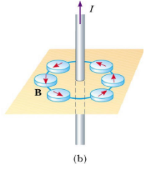

# Magnetic Field 
---
- ### The Nature of Magnetism
	- magnets were first discovered 2000 years ago 
	- unlike electrical effects due to the rubbing of various substances, these magnets came out of the ground already attracting/repelling materials
	- when a magnetic matieral was shaped in the form of a needle and floated on the surface of water, it always pointed in the same direction 
	- this made the compass possible, and thus started the age of exploration 
	- Recall:
		- Magnets have two poles called **N**orth and **S**outh (N or S for short). Like poles repel, oppisate poles attract
		- when a magnet is cut in half, each peice will still have a north and a south pole 
		- "monopol" magnets are therotical magnets that could potentially only have one pole, but noone has found one
		- magnetnitc field lines work exactly like eletric field lines, with  $N$ being positve and $S$ being negative
		- the earths magnetic field is simlar to that of a bar magnet, and is caused by the molten iron in the earths core 
		- the earths "North pole" is actually a southpole, as it attracts the north end of the compass
- ### Origin of magnetic fields
	- current creates centipedal magnetic fields
		- 
	- bassicly the borh model of the atom shows electrons orbiting the nucleas
	- therefore since electrons are chargins and they are moving, thats bassicly currrent, and current generates a magnetic field 
	- most of these magnetic fields causes by the electrons moving is cancled out (cause average random vector is 0)
	- electron spin is also a factor for the strngnth of the magnetic field
	- some atoms have a very specific electron configuration that cause them to have a "magnetic dipole" (like a charge dipole) 
	- this dpiloe will cause a magnetic field to be producted by the object, and that vector is called the magnetic dipole moment 
	- each group of moments is called a magnetic domain, and in each domain each atom has the the same vector
	- image is of a non magnetic material and a magnetic material
		- 
	- three types of magneitc materials:
		- Ferromagnetic
			- these mateirals can be permantly magntized by the applciation of a field 
		- Paramagnetic
			- these materials will weakly maganitze by the application of the field and attract to the source of the field, and when the field is removed the domains resume thier random ordering
		- Dimagnetic
			- these materials will weakly magnitze by the applicatino of the field and repel to the source o fthe field, and when the field is removed the domains reusem thier random ordering 
		- 
## Direction of a magnetnic field due to a current carrying wire
- Right hand grip rule:
	- 
- at any given point on this circle, the magnetic field vector is the tangent of the circle
- vector addition to find the magneitc field vector with mutliple charges
- the symbol of a magnetic field is $B$ and the unit is Tesla, where $T = \frac{N}{A\cdot m}$
- because tesla is a large magnitude, Gauss is used often, where $G=T\times 10^{-4}$
- earths magnetic field is $0.5 G$
- the current of a wire can be calcuatled by the following formula
$$
\begin{gather} 
B=\frac{\mu _{0}}{2\pi} \cdot \frac{I}{r} \\
\text{where } \mu_{0} = 4\pi \times 10^{-7} \frac{Tm}{A} = \epsilon_{0}
\end{gather}

$$
- 
# Magnetic Force on a Moving Electric Charge
---
- magnetic poles exert a force on each other, but a magnetic field will exert a force on amoving charge. 
- if the charge is not moving iut does not feel the force 
- the force is related to the velocity of the charge 
$$
\begin{gather}
\vec{F_{M}} = q \vec{v} \times \vec{B}  \\

|\vec{F_{M}} |= |q \vec{v}| |\sin(\theta)| |\vec{B}|
\end{gather}
$$
- the angle $\theta$ is given by the angle between the velcity vector and the magnetic field vector

# Uniform Circular Motion due to am agnetic field
- magnetic field does not do any work (no change in kinetic energy just work)
- since force goes inwards, the velcoity of the charge will begin to shift inwards, and start tracing a circle

REAL LIFE APPLCIATION
mass spectrometer
a mass spectromerter is used to figure out what an atom is
shoot a particle with a velcoity through a magnetic fiekld, you can see the force it experince and therefore derive its cahrge
l

$$
\begin{gather}
\int \pi \sigma \Sigma 
\end{gather}

$$